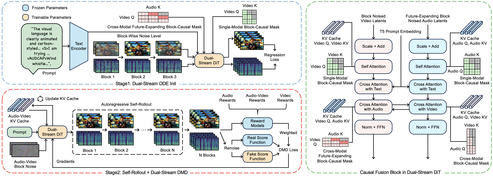

<!-- <h1 align="center">Hallo-Live</h1> -->
<h1 align="center">Hallo-Live: Real-Time Streaming Joint Audio-Video Avatar Generation</h1>

<div align='center'>
<a href="https://github.com/chunyu-li" target="_blank">Chunyu Li</a><sup>1,2,*</sup> &emsp;
<a href="https://github.com/fudan-generative-vision/Hallo-Live" target="_blank">Jiaye Li</a><sup>2,*</sup> &emsp;
<a href="https://github.com/fudan-generative-vision/Hallo-Live" target="_blank">Ruiqiao Mei</a><sup>2</sup> &emsp;
<a href="https://github.com/fudan-generative-vision/Hallo-Live" target="_blank">Haoyuan Xia</a><sup>1,3</sup>
</div>
<div align='center'>
<a href="http://zhuhao.cc/home/" target="_blank">Hao Zhu</a><sup>4</sup> &emsp;
<a href="https://jingdongwang2017.github.io/" target="_blank">Jingdong Wang</a><sup>5</sup> &emsp;
<a href="https://sites.google.com/site/zhusiyucs/home" target="_blank">Siyu Zhu</a><sup>1,2,&dagger;</sup>
</div>

<br>

<div align='center'>
<sup>1</sup>Shanghai Innovation Institute &emsp;
<sup>2</sup>Fudan University
</div>
<div align='center'>
<sup>3</sup>University of Science and Technology of China &emsp;
<sup>4</sup>Nanjing University &emsp;
<sup>5</sup>Baidu
</div>

<br>

<div align="center">

[](https://arxiv.org/abs/2604.23632)
[](https://huggingface.co/fudan-generative-ai/Hallo-Live)
[](LICENSE)

</div>

## 📖 Introduction

We present *Hallo-Live*, a real-time text-driven joint audio-video avatar generation framework. The method adopts a causal dual-stream DiT model to generate synchronized avatar video and speech in a streaming manner. *Hallo-Live* reaches **20.38 FPS** with **0.94 s latency** on two NVIDIA H200 GPUs, while preserving strong lip-sync accuracy, visual fidelity, and speech quality.

## 🏗️ Framework

<p align="center">

<p>

The framework of *Hallo-Live*. **Top left**: Stage I training adapts a pretrained dual-stream DiT to the streaming setting using cross-modal future-expanding block-causal mask. **Bottom left**: Stage II training performs autoregressive self-rollout with the audio-video KV cache and optimizes the generated trajectory with reward-weighted dual-stream DMD. **Right**: Each causal fusion block in the dual-stream DiT consists of cross-modal attention between the video and audio streams, where the block-causal masks are utilized in Stage I ODE initialization, and KV cache is maintained for Stage II self-rollout and streaming inference.

## 🎬 Demo

Click the prompt preview to expand the full text.

<table class="center" width="100%">
  <colgroup>
    <col width="50%">
    <col width="50%">
  </colgroup>
  <tr style="font-weight: bolder;text-align:center;">
        <td width="50%"><b>Input Prompt</b></td>
        <td width="50%"><b>Generated Video</b></td>
  </tr>
  <tr>
    <td width="50%">
      <details>
        <summary>Office close-up, man asks about the slides...</summary>
        Close-up on a man in an office. Window light creates soft highlights. He wears a suit, lapel texture visible. Background is blurred desks. He sits in chair, back straight. Face is head-and-shoulders, mouth sharp. He nods slightly while speaking. &lt;S&gt;Meeting starts in five.&lt;E&gt; &lt;S&gt;Have you got the slides?&lt;E&gt; &lt;AUDCAP&gt;Office hum, phone ring distant, professional male voice with clear articulation; no music.&lt;ENDAUDCAP&gt;
      </details>
    </td>
    <td width="50%">
      <video src=https://github.com/user-attachments/assets/f3efd06c-6cb3-42d4-9a9a-b78244d12993 controls preload="metadata" width="100%"></video>
    </td>
  </tr>
  <tr>
    <td width="50%">
      <details>
        <summary>3D anime recording studio, asking for one more take...</summary>
        3D anime cartoon style, polished toon-shaded character rendering, soft stylized materials, expressive face and eyes, smooth animation-ready posing, clear mouth shapes for readable lip sync. In a dimly lit recording studio with acoustic foam panels, a woman with curly brown hair sits framed head-and-shoulders. A large condenser microphone stands slightly off-axis to avoid plosives. Soft blue LED strip light outlines the background gear. Her skin shows natural texture under the key light. She holds a lyric sheet steady in her left hand, fingers visible against the white paper. No sudden movements occur. She breathes in slowly, then speaks directly into the mic. Her lips part clearly for each word. The paper remains still in her grip throughout the clip. &lt;S&gt;I think we need one more take.&lt;E&gt; &lt;S&gt;The harmony felt rushed.&lt;E&gt; &lt;AUDCAP&gt;Clear female voice with soft reverb; faint hum of ventilation; rustle of paper; no music; close proximity effect on mic; room tone is present.&lt;ENDAUDCAP&gt;
      </details>
    </td>
    <td width="50%">
      <video src=https://github.com/user-attachments/assets/987043fa-9390-48af-a2b3-7d6480e0be0b controls preload="metadata" width="100%"></video>
    </td>
  </tr>
  <tr>
    <td width="50%">
      <details>
        <summary>Hand-drawn anime cafe scene, waiting until midnight...</summary>
        Hand-drawn anime style with clean outlines, stylized proportions, bright illustrated lighting, detailed background art, expressive facial acting, crisp lip movement. Framed in close-up head-and-shoulders, a man with stubble sits in a dimly lit cafe. Neon sign glow reflects in his eyes, casting blue rim light on his profile. A condensation-covered glass sits on the table edge, visible in lower frame. His lips are sharp under the mixed lighting, moving clearly as he talks. His left hand rests on the table edge, fingers visible; no objects pass in front of it. He blinks slowly, then speaks with a slight nod. &lt;S&gt;They said the train was delayed.&lt;E&gt; &lt;S&gt;Now we wait until midnight.&lt;E&gt; &lt;AUDCAP&gt;Low cafe murmur, ice clinking in glass, HVAC hum; tired male voice with low resonance.&lt;ENDAUDCAP&gt;
      </details>
    </td>
    <td width="50%">
      <video src=https://github.com/user-attachments/assets/a26173d4-c3fc-48ee-baae-00c231302539 controls preload="metadata" width="100%"></video>
    </td>
  </tr>
  <tr>
    <td width="50%">
      <details>
        <summary>Clay-court tennis player, retrying a serve...</summary>
        A tennis player stands on a clay court, framed chest-up in a tight-medium shot, red dust visible on his shirt. Sunlight is bright but diffused by a slight haze, preventing harsh shadows on his face. He holds a racket over his shoulder, the grip tape texture visible and hand position static. The camera remains steady, focusing on his eyes and the sweat on his brow. His mouth is open slightly as he speaks, clearly readable against the blurred net background. He shifts his weight slowly from one foot to the other, avoiding sudden jerks. &lt;S&gt;That serve was too wide.&lt;E&gt; &lt;S&gt;Let's try again, same spot.&lt;E&gt; &lt;AUDCAP&gt;Wind blowing across court; distant ball thud; clear male voice with athletic breath; clay court surface noise; natural outdoor sports ambience without crowd noise.&lt;ENDAUDCAP&gt;
      </details>
    </td>
    <td width="50%">
      <video src=https://github.com/user-attachments/assets/9e7996d4-d600-4687-8b76-7e700635fae5 controls preload="metadata" width="100%"></video>
    </td>
  </tr>
  <tr>
    <td width="50%">
      <details>
        <summary>3D anime office scene, man reviewing the numbers...</summary>
        3D anime cartoon style, polished toon-shaded character rendering, soft stylized materials, expressive face and eyes, smooth animation-ready posing, clear mouth shapes for readable lip sync. In a quiet office with fluorescent overhead lights reflecting on a glass partition, a man in a blue button-down shirt sits in a close-up shot. Dust motes float in the light beams near his shoulder. His face is evenly lit, mouth clearly visible and sharp from the first frame. He holds a black pen in his right hand, resting on a notebook; the pen remains visible and stationary throughout. He blinks slowly, then speaks with calm emphasis, lips forming words cleanly. Both hands remain visible at desk level; no objects pass in front of his face. &lt;S&gt;I reviewed the numbers twice this morning.&lt;E&gt; &lt;S&gt;Everything checks out on our end.&lt;E&gt; &lt;AUDCAP&gt;Low hum of office HVAC; clear male voice with neutral accent; soft pen tap on paper; no music.&lt;ENDAUDCAP&gt;
      </details>
    </td>
    <td width="50%">
      <video src=https://github.com/user-attachments/assets/48d4782a-8805-4ea3-8005-4859ddaf4d37 controls preload="metadata" width="100%"></video>
    </td>
  </tr>
</table>

## 🔧 Installation

### 1. Environment Setup

Create and activate the conda environment, then install Python dependencies:

```bash
source tools/setup_env.sh
```

### 2. Download Models

Set the model root `MODEL_DIR=/path/to/your/model_dir` in `tools/download_models.sh` before downloading.

For inference, you only need to download the required text encoder, VAEs, and DiT models:

```bash
bash tools/download_models.sh inference
```

For vanilla training or RL-based training, download the additional models as needed:

```bash
# Ovi model as real/fake score function for train.py
bash tools/download_models.sh train

# Optional reward models for RL-based training
bash tools/download_models.sh reward
```

## 🚀 Inference

Before inference, make sure the `MODEL_DIR` in `scripts/inference.sh` points to the root directory that contains the downloaded models, then run the script:

```bash
bash scripts/inference.sh
```

Generated videos will be saved in `output_folder`.

## 🏋️‍♂️ Training

Training uses `torchrun` and FSDP. Before launching, check the following fields in the config:

- `model_dir`: directory containing Ovi, Wan, MMAudio, and optional reward checkpoints.
- `data_path`: prompt CSV or LMDB path.
- `generator_ckpt`: initialization checkpoint for the student.
- `real_score_ckpt` and `fake_score_ckpt`: teacher and critic initialization checkpoints.
- `save_ckpt_dir`: output directory for training checkpoints.
- `sharding_strategy`, `generator_fsdp_wrap_strategy`, `real_score_fsdp_wrap_strategy`, `fake_score_fsdp_wrap_strategy`: distributed training strategy.

### Stage 1: Dual-Stream ODE Initialization

This repository provides utilities for generating ODE initialization data and packing it into LMDB:

```bash
bash scripts/sample_ode_data.sh
```

The script performs three steps:

1. Generate ODE trajectories with `hallolive.utils.sample_ode_data`.
2. Build video-to-prompt mappings with `tools/create_video_mappings.py`.
3. Convert latent `.pt` files into LMDB with `hallolive.utils.create_lmdb_fusion`.

After the LMDB dataset is created, run the script for ODE initialization training:

```bash
bash scripts/train_ode_fusion.sh
```

### Stage 2: Self-Rollout + Dual-Stream DMD

First, modify the `generator_ckpt` path in the config file to point to the checkpoint obtained after completing your ODE initialization training. Then run the script for DMD training:

```bash
bash scripts/train_dmd_fusion_5B.sh
```

To reproduce HP-DMD, enable reward guidance in the DMD config:

```yaml
enable_rl_reward: true
reward_types: [videoalign, audiobox, sync]
reward_beta: 2.0
reward_model_cpu_offload: true
```

The paper uses a continued Stage 2 strategy: first train video and audio jointly until the video stream stabilizes, then freeze the video stream and continue audio-only optimization. In this repository, audio-only continued training is controlled by:

```yaml
train_audio_stream_only: true
video_loss_weight: 0
audio_loss_weight: 0.15
```

See `configs/dmd_fusion_5B_audio.yaml` for an example.

## 📊 Evaluation

Run batch inference for checkpoint evaluation:

```bash
bash scripts/inference_eval.sh
```

The script generates videos for selected checkpoint steps and writes `video_prompt_mappings.json` for downstream scoring.

## 🙏 Acknowledgements

This project builds on and benefits from the following open-source projects and research codebases:

- [Ovi](https://github.com/character-ai/Ovi) for high-quality joint audio-video generation.
- [Self-forcing](https://github.com/guandeh17/Self-Forcing) for autoregressive self-rollout training and DMD code.
- [Wan](https://github.com/Wan-Video/Wan2.2) for video generation components.
- [MMAudio](https://github.com/hkchengrex/MMAudio) for audio VAE components.
- [VideoAlign](https://github.com/KwaiVGI/VideoAlign), [AudioBox Aesthetics](https://github.com/facebookresearch/audiobox-aesthetics) and [SyncNet](https://github.com/joonson/syncnet_python) for reward modeling.

<!-- ## 📖 Citation

If you find this repository useful, please cite:

```bibtex
@article{li2026hallolive,
  title={Hallo-Live: Real-Time Streaming Joint Audio-Video Avatar Generation with Asynchronous Dual-Stream and Human-Centric Preference Distillation},
  author={Li, Chunyu and Li, Jiaye and Mei, Ruiqiao and Xia, Haoyuan and Zhu, Hao and Wang, Jingdong and Zhu, Siyu},
  journal={arXiv preprint arXiv:2604.23632},
  year={2026}
}
``` -->
